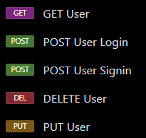

# Testes no Insomnia

Porta: http://localhost/3000.

#### Testes nas rotas de login

| Ordem | Método HTTP |    Rota    | Tipo de corpo |                                             Conteúdo do corpo                                             | Código de resposta | Erro                                                                              |            Status BD            | Êxito |
|:-----:|:-----------:|:----------:|:-------------:|:---------------------------------------------------------------------------------------------------------:|:------------------:|-----------------------------------------------------------------------------------|:-------------------------------:|:-----:|
|   1   |     GET     |  `/login`  |       -       |                                                     -                                                     |        200         | -                                                                                 |                -                |  ✔️   |
|   2   |    POST     |  `/login`  |     JSON      |                               "username": "username1", "password": 12345678                               |        404         | Usuário não existia                                                               |         Sem alterações          |  ✔️   |
|   3   |    POST     | `/signup`  |     JSON      |                               "username": "username1", "password": 12345678                               |        200         | -                                                                                 | Usuário adicionado corretamente |  ✔️   |
|   4   |   DELETE    | `/account` |     JSON      |                               "username": "username1", "password": 12345678                               |        401         | TypeError                                                                         |         Sem alterações          |   ❌   |
|   5   |     PUT     | `/account` |     JSON      | "username": "username1", "password": 12345678,   "newUsername": "username2", "newPassword": "abcdefgh" |        200         | MongoInvalidArgumentError: Replacement document must not contain atomic operators |         Sem alterações          |   ❌   |
|   6   |     GET     |  `/login`  |       -       |                                                     -                                                     |        200         | -                                                                                 |         Sem alterações          |  ✔️   |
|   7   |    POST     | `/signup`  |     JSON      |                                "username": "userA", "password": "12345678"                                |         -          | Timeout - SSL Client Error - Current IP not added                                 |         Sem alterações          |   ❌   |
|   8   |    POST     | `/signup`  |     JSON      |                                "username": "userA", "password": "12345678"                                |        200         | -                                                                                 | Usuário adicionado corretamente |  ✔️   |
|   9   |   DELETE    | `/account` |     JSON      |    "username": "userA", "password": "12345678",   "newUsername": "userC", "newPassword": "87654321"    |        402         | TypeError                                                                         |         Sem alterações          |  ✔️   |
|  10   |     PUT     | `/account` |     JSON      |    "username": "userA", "password": "12345678",   "newUsername": "userC", "newPassword": "87654321"    |        200         | Não foram alterados os dados, apesar de não haver erro de execução                |         Sem alterações          |   ❌   |
|  11   |     PUT     | `/account` |     JSON      |    "username": "userA", "password": "12345678",   "newUsername": "userC", "newPassword": "87654321"    |        404         | MongoInvalidArgumentError                                                         |         Sem alterações          |   ❌   |
|  12   |     PUT     | `/account` |     JSON      |    "username": "userA", "password": "12345678",   "newUsername": "userC", "newPassword": "87654321"    |        500         | MongoInvalidArgumentError: Replacement document must not contain atomic operators |         Sem alterações          |   ❌   |
|  13   |     PUT     | `/account` |     JSON      |    "username": "userA", "password": "12345678",   "newUsername": "userC", "newPassword": "87654321"    |        500         | ReferenceError: Cannot access 'b' before initialization                           | Usuário modificado corretamente |  ❗️   |
|  14   |     PUT     | `/account` |     JSON      |   "username": "userC", "password": "87654321",   "newUsername": "userABC", "newPassword": "45689631"   |        500         | ReferenceError: Cannot access 'b' before initialization                           | Usuário modificado corretamente |  ❗️   |
|  15   |     PUT     | `/account` |     JSON      | "username": "userABC", "password": "45689631",   "newUsername": "userTEST", "newPassword": "000000000" |        403         | Falha na atualização de usuário - Não foi encontrado um usuário com estes dados   | Usuário modificado corretamente |   ❌   |
|  16   |     PUT     | `/account` |     JSON      |         "username": "user", "password": "444",   "newUsername": "user2", "newPassword": "8888"         |        200         | -                                                                                 | Usuário modificado corretamente |  ❗️   |
|  17   |   DELETE    | `/account` |     JSON      |                                  "username": "user2", "password": "8888"                                  |        402         | TypeError                                                                         |  Usuário excluído corretamente  |  ❗️   |
|  18   |    POST     | `/signup`  |     JSON      |                               "username": "username1", "password": 12345678                               |        200         | -                                                                                 | Usuário adicionado corretamente |  ✔️   |
|  19   |   DELETE    | `/account` |     JSON      |                               "username": "username1", "password": 12345678                               |        500         | TypeError                                                                         |  Usuário excluído corretamente  |  ❗️   |
|  20   |    POST     | `/signup`  |     JSON      |                               "username": "username1", "password": 12345678                               |        200         | -                                                                                 | Usuário adicionado corretamente |  ✔️   |
|  21   |   DELETE    | `/account` |     JSON      |                              "username": "username1", "password": "12345678"                              |        200         | Erro: usuário não deletado, mesmo sem indicações de erro                          |      Usuário não excluído       |  ❗️   |
|  22   |   DELETE    | `/account` |     JSON      |                               "username": "username1", "password": 12345678                               |        200         | -                                                                                 |  Usuário excluído corretamente  |  ✔️   |
|  23   |     GET     |  `/login`  |       -       |                                                     -                                                     |        200         | -                                                                                 |                -                |  ✔️   |
|  24   |    POST     | `/signup`  |     JSON      |                                   "username": "user", "password": "abc"                                   |        200         | -                                                                                 | Usuário adicionado corretamente |  ✔️   |
|  25   |    POST     | `/signup`  |     JSON      |                                   "username": "user", "password": "abc"                                   |        409         | Erro: o usuário já existe                                                         |         Sem alterações          |  ✔️   |

- A maioria dos erros de tipagem foi causada pela falta de tratamento no assíncronismo dos métodos.
- Observe que existem erros em que não houve indicação de nenhuma parte (nem do serviço, nem da requisição, tampouco do banco), mas a tarefa não foi concluída como deveria.

#### Testes nas rotas de notas

| Ordem | Método HTTP |                        Rota                         |      Tipo de corpo       |                         Conteúdo do corpo                          | Código de resposta | Erro |            Status BD            | Êxito |
|:-----:|:-----------:|:---------------------------------------------------:|:------------------------:|:------------------------------------------------------------------:|:------------------:|:----:|:-------------------------------:|:-----:|
|   1   |    POST     |           `http://localhost:3000//login`            |           JSON           |               "username": "user", "password": "abc"                |        200         |  -   |                -                |  ✔️   |
|   2   |     GET     |    `http://localhost:3000//notes/:user/:noteId`     | Automático (`.redirect`) |                                 -                                  |                    |  -   |                -                |  ✔️   |
|   3   |    POST     | `http://localhost:3000//notes/:user/:noteId/:title` |            -             |                                 -                                  |                    |  -   |                -                |  ✔️   |
|   4   |    POST     |           `http://localhost:3000/signup`            |           JSON           | "name":"joao8","username": "joao@gmail.com","password": "12345678" |        200         |      | Usuário adicionado corretamente |  ✔️   |
|   5   |    POST     |            `http://localhost:3000/login`            |           JSON           |        "username": "joao@gmail.com", "password": "12345678"        |        200         |  -   |        Acesso permitido         |  ✔️   |
